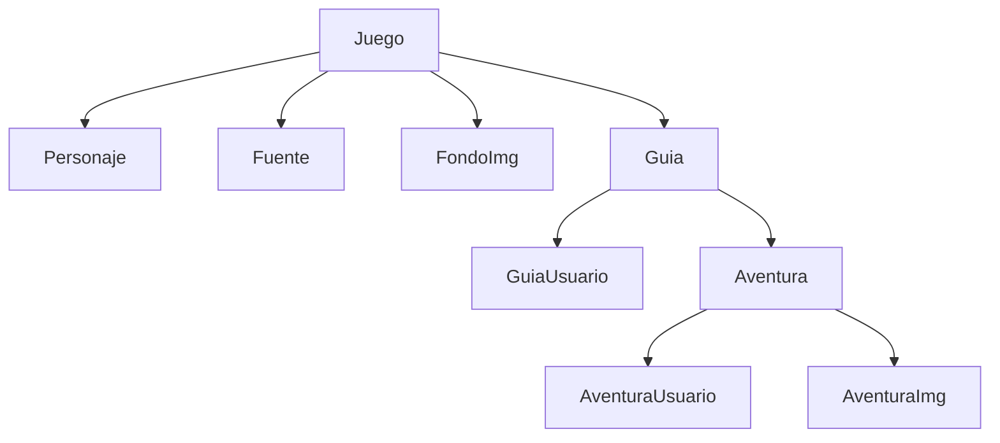

# Guida Game Class Library .NET 7

## Dependencies
```
Microsoft.EntityFrameworkCore.SqlServer
Microsoft.EntityFrameworkCore.Tools
```

## Structura de clases


## JSon
```
```

# Conecction Class
```
public class GamesGuideDbContext : DbContext
{
    public GamesGuideDbContext(DbContextOptions<GamesGuideDbContext> options) : base(options)
    {
    }

    public DbSet<GJGameEntity> GJ_Games { get; set; }

    protected override void OnModelCreating(ModelBuilder modelBuilder)
    {
        modelBuilder.Entity<GJGameEntity>(t =>
        {
            t.HasKey(c => c.Id);
            t.Property(c => c.Name).HasColumnType("VARCHAR(50)");
            t.Property(c => c.Description).HasColumnType("VARCHAR(256)");
            t.Property(c => c.ImgUrl).HasColumnType("VARCHAR(256)");
        });

    }
}
```

# Migration
* The main project must be selected as the Startup Project in your solution. Additionally, in the Package Manager Console, you need to select the Entities Project as the default project before running commands like migrations or updates.

```
Add-Migration Inicial
Update-DataBase
```

```
Add-Migration -Context GuiaJuegosDbContext Inicial
Update-DataBase -Context GuiaJuegosDbContext
```


