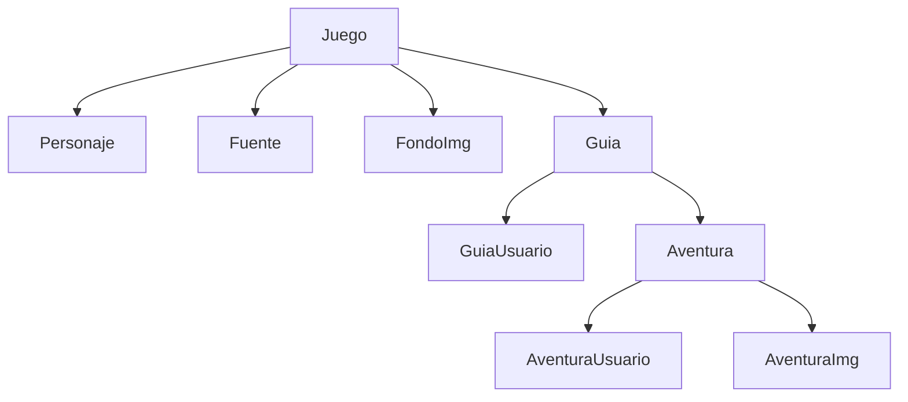

# Guida Game Class Library .NET 7

## Dependencies
```
Microsoft.EntityFrameworkCore.SqlServer
Microsoft.EntityFrameworkCore.Tools
ClassLibrary.Common
```

## Structura de clases


## JSon
```
```

# One to Many Entities that represent Database
```
public class GameEntity
{
    public int Id { get; set; }
    public string Name { get; set; } = string.Empty;
    public string Description { get; set; } = string.Empty;
    public string ImgUrl { get; set; } = string.Empty;
    public bool IdActive { get; set; }
    public ICollection<CharacterEntity> Characters { get; set; }
}
```
```
public class CharacterEntity
{
    public int Id { get; set; }
    public string Name { get; set; } = string.Empty;
    public string Description { get; set; } = string.Empty;
    public string ImgUrl { get; set; } = string.Empty;
    public int Id_Game { get; set; }
    public GameEntity Game { get; set; }
}
```

# Conecction Class
```
public class GamesGuideDbContext : DbContext
{
    public GamesGuideDbContext(DbContextOptions<GamesGuideDbContext> options) : base(options)
    {
    }

    public DbSet<GameEntity> GG_Games { get; set; }
    public DbSet<CharacterEntity> GG_Character { get; set; }

    protected override void OnModelCreating(ModelBuilder modelBuilder)
    {
        modelBuilder.Entity<GameEntity>(t =>
        {
            t.HasKey(e => e.Id);
            t.Property(e => e.Name).HasColumnType("VARCHAR(50)");
            t.Property(e => e.Description).HasColumnType("VARCHAR(256)");
            t.Property(e => e.ImgUrl).HasColumnType("VARCHAR(256)");
        });

        modelBuilder.Entity<CharacterEntity>(t =>
        {
            t.HasKey(e => e.Id);
            t.Property(e => e.Name).HasColumnType("VARCHAR(50)");
            t.Property(e => e.Description).HasColumnType("VARCHAR(256)");
            t.Property(e => e.ImgUrl).HasColumnType("VARCHAR(256)");
            t.HasOne(tr => tr.Game)
                .WithMany(tr => tr.Characters)
                .HasForeignKey(c => c.Id_Game)
                .OnDelete(DeleteBehavior.Restrict);
        });
    }
}
```

# Migration
* The main project must be selected as the Startup Project in your solution. Additionally, in the Package Manager Console, you need to select the Entities Project as the default project before running commands like migrations or updates.

```
Add-Migration Inicial
Update-DataBase
```

```
Add-Migration -Context GuiaJuegosDbContext Inicial
Update-DataBase -Context GuiaJuegosDbContext
```
