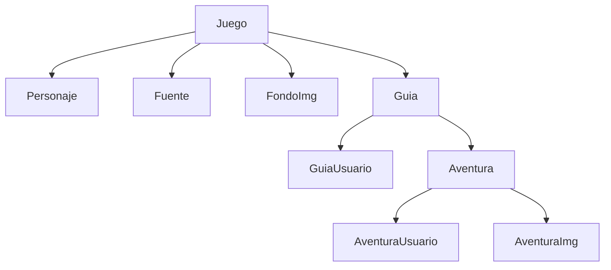

# Guida Game Class Library .NET 7

## Dependencies
```
Dapper
Microsoft.EntityFrameworkCore.SqlServer
ClassLibrary.Common
```

## Structura de clases


## JSon
```
{
  "isSucces": true,
  "statusCode": 0,
  "message": "string",
  "data": [
    {
      "id": 0,
      "name": "string",
      "description": "string",
      "imgUrl": "string",
      "isActive": true,
      "characters": [
        {
          "id": 0,
          "name": "string",
          "description": "string",
          "imgUrl": "string"
        }
      ],
      "sources": [
        {
          "id": 0,
          "name": "string",
          "url": "string"
        }
      ],
      "backgrounds": [
        {
          "id": 0,
          "imgUrl": "string"
        }
      ],
      "guides": [
        {
          "id": 0,
          "name": "string",
          "sort": 0,
          "adventures": [
            {
              "id": 0,
              "description": "string",
              "isImportant": true,
              "sort": 0,
              "adventuresImg": [
                {
                  "id": 0,
                  "imgUrl": "string",
                  "sort": 0
                }
              ],
              "adventuresUser": [
                {
                  "id_Adventure": 0,
                  "id_User": "string",
                  "isCheck": true
                }
              ]
            }
          ],
          "guidesUser": [
            {
              "id_Guide": 0,
              "id_User": "string",
              "isCheck": true
            }
          ]
        }
      ]
    }
  ]
}
```

# Endpoint ApiKey
```
public class ApiKeyService 
{
    private readonly IDbConnection _dapper;

    public ApiKeyService(IDbConnection dapper)
    {
        _dapper = dapper;
    }

    public async Task<bool> ValidateApiKey(string apiKey)
    {
        try
        {
            var result = await _dapper.QueryFirstOrDefaultAsync<ApiKey>(
                $"SELECT ApiKey FROM Mae_Config WHERE Id = @Id",
                new { Id = 1 });

            if (result == null) return false;

            return apiKey.Equals(result) ? true : false;
        }
        catch (Exception ex)
        {
            throw new Exception(ex.Message);
        }
    }
}
```

