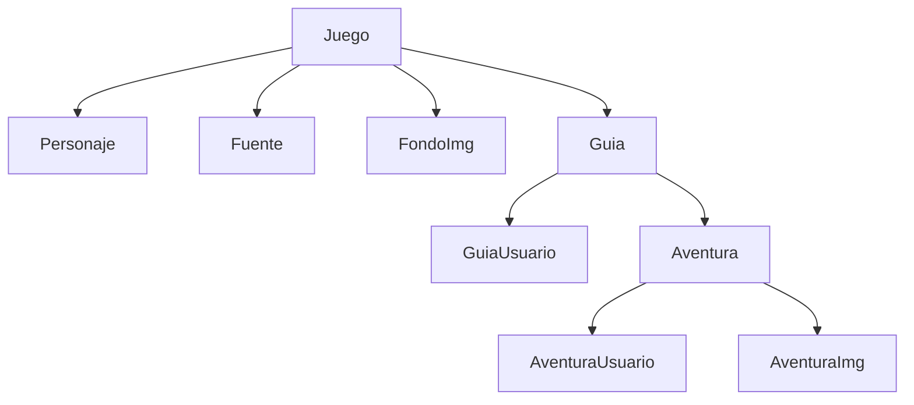

# Class Library Guia Juegos

### Dependencias
```
Microsoft.EntityFrameworkCore
Microsoft.EntityFrameworkCore.Tools
```
```
Microsoft.EntityFrameworkCore.Design
```
> [!WARNING]  
> Para una migracion exitosa EntityFrameworkCore.Tools debe estar en el projecto que contienen las Entidades que representan la Base de datos, y EntityFrameworkCore.Design debe estar en el projecto en donde esta la ruta de conexion a la Base de Datos.

### Structura de clases


### JSon
```
```

## Clase de Conexion y Migracion
### Clase DbContext
```
public class GuiaJuegosDbContext : DbContext
{
    public GuiaJuegosDbContext(DbContextOptions<GuiaJuegosDbContext> options) : base(options)
    {
    }

    public DbSet<GJJuegoEntity> GJ_Juegos { get; set; }
}
```
### Usar Consola NuGet
* Migracion generica
```
Add-Migration Inicial
Update-DataBase
```
* Migracion especifica
```
Add-Migration -Context GuiaJuegosDbContext Inicial
Update-DataBase -Context GuiaJuegosDbContext
```
> [!WARNING]  
> Estos comandos se deben unsar en el projecto que contienen las entidades que representan la Base de Datos.

## Services
```
```

